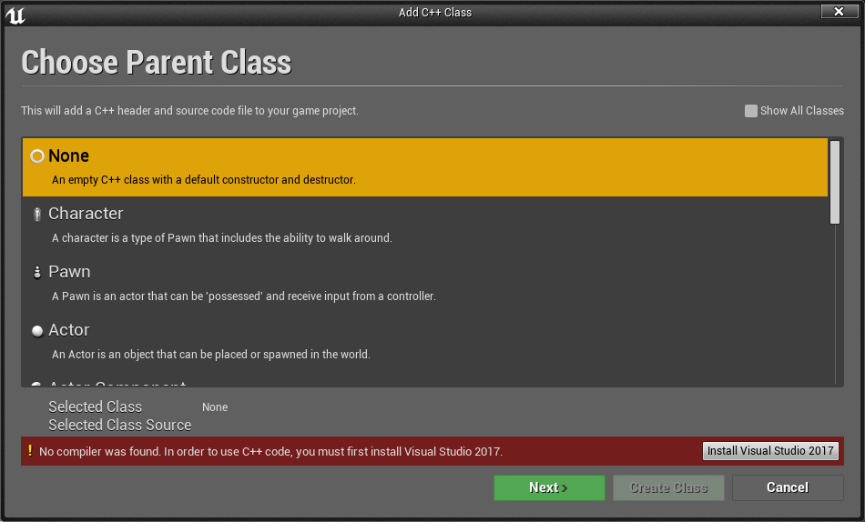
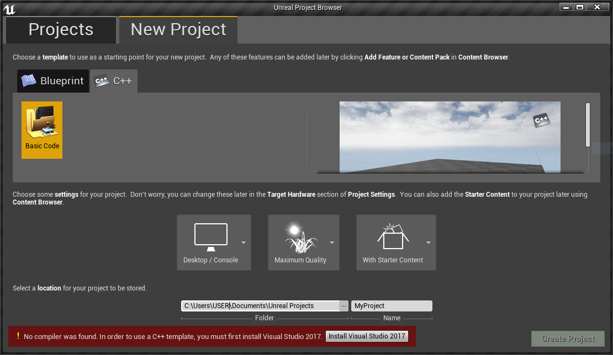
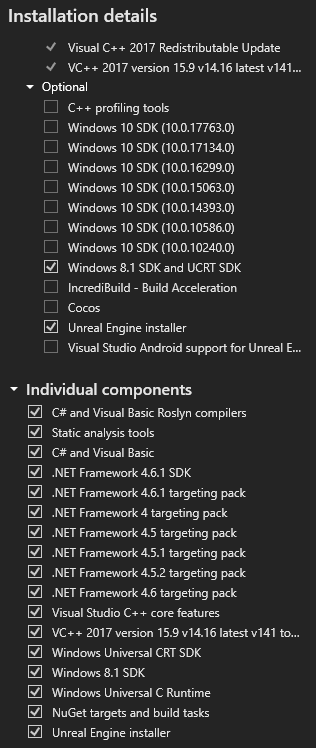

# Build Arise-Multiplayer Mod

This mod uses [Unreal Engine Mod Loader](https://github.com/RussellJerome/UnrealModLoader) and consists of two components:

1. The native code (written in C++)
2. The blueprints that handle some stuff in UE4

## Pre-Requisites

- [Unreal Engine 4.20](https://www.epicgames.com/download) (`Core Components`, `Starter Content`)
- [Visual Studio 2017](https://visualstudio.microsoft.com/vs/older-downloads/) for UE4.20 (Workloads: `Game development with C++`; Individual Components: `C# and Visual Basic Roslyn compilers`, `Static analysis tools`, `C# and Visual Basic`, `.NET Framework 4.6.1 SDK`, `.NET Framework (4, 4.5, 4.5.1, 4.5.2, 4.6, 4.6.1) targeting pack`, `Visual Studio C++ core features`, `VC++ 2017 version 15.9 v14.16 latest v141 tools`, `Windows Universal CRT SDK`, `Windows 8.1 SDK`, `Windows Universal C Runtime`, `NuGet targets and build tasks`, `Unreal Engine installer`)

It can be installed via UE4Editor: `File` > `New C++ Class...`.

It can be installed via UE4Launcher: `Unreal Engine` > `Library` > `4.20.3 Launch` > `New Project` > `C++`.

It can be configured via Visual Studio Installer:

- [Visual Studio 2017 or newer](https://visualstudio.microsoft.com/vs/older-downloads/) for ModLoader (Workloads: `Desktop C++`)
- [CMake 3.8+](https://cmake.org/download/)

`git clone --recursive https://github.com/EusthEnoptEron/arise-multiplayer`

## Steps: Unreal Engine Export

1. Open 'arise-multiplayer/Unreal/Arise.uproject'.
2. On first start click `Yes` to rebuild `Arise` and `InputExtPlugin`.
3. Dismiss Message Log with some warnings/errors.
4. `File` > `Export Project` > `Windows` > `Windows (64-bit)`
5. Select root folder of the repository, so it'll create `arise-multiplayer/WindowsNoEditor`. If you select `arise-multiplayer/WindowsNoEditor`, `arise-multiplayer/WindowsNoEditor/WindowsNoEditor` will be created instead!

## Steps: UnrealModLoader and Mod

1. `cd Mod`
2. `cmake -B build -S . -G "Visual Studio 15 2017 Win64"` (or "Visual Studio 16 2019"/"Visual Studio 17 2022" without Win64), or use CMake-GUI.
3. Open `arise-multiplayer/Mod/build/UnrealEngineModLoader.sln`.
4. Build all 4 modules.
5. Build the `INSTALL` target to collect and rename the files in `arise-multiplayer/Mod/install`.
