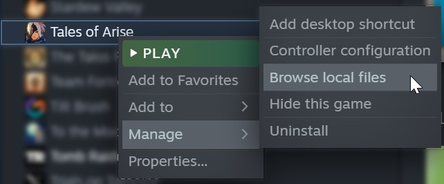

# Tales of Arise: Multiplayer Mod


Mod that adds multiplayer to Tales of Arise. For progress, see <!-- [Milestones](https://github.com/EusthEnoptEron/arise-multiplayer/milestones) and--> the [Project page](https://github.com/EusthEnoptEron/arise-multiplayer/projects/1).

This is still to be considered experimental until someone says it's stable. Let me know via [GitHub](https://github.com/EusthEnoptEron/arise-multiplayer/issues) or [Discord](https://discord.gg/Se2XTnA) when you encounter untracked issues.

## Why?

Because this is how God intended *Tales of* to be.

## How To Install

1. Extract files to the local game data folder. (See image how to get there.)

    
3. Start the game.

During battle, controllers will automatically be assigned to the characters. See below for details on the order.

> :warning: If `xinput1_3.dll` already exists because you installed another mod (e.g. Arise SDK), skip the file and launch UnrealEngineModLauncher.exe before starting the game.

## How To Use

1. Plug in a second (or third, or fourth) controller.

The controllers will then be assigned to the 2nd, 3rd, and 4th character respectively and will be able to control these characters.

For details, [refer to Controls](#controls).

## How To Disable

Temporarily:

- Unplug all other controllers.

Completely:
1. Remove `xinput1_3.dll`.
2. Optionally, remove all files included in the archive.

## Known Issues

No critical issues known at this time.

For a complete list, see [issues](https://github.com/EusthEnoptEron/arise-multiplayer/issues)

Please comment or add new issues if you encounter any that haven't been reported yet.


## Controls

### Controller Order

- Player numbers are initially assigned in the order Steam reports them.
- When a controller disconnects, the player number will become free again and control is returned to the CPU.
- When a controller connects, it is assigned the first free player number.

The characters are assigned in this order:

| Player | Party Member |
| ------ | ------------ |
| P2     | Left  |
| P3     | Right |
| P4     | Bottom |


### Battle Controls

During battle, each player gets to control their own character. Make sure that P1 (= the flag) is assigned to the top
party member.

#### Boost Attacks

By default, boost attacks can be used by all players to add some competitiveness to the mix. See [Customization](#customization) for instructions on how to restrict the usage of boost attacks.

#### Changing Characters During Battle

By default, all players can switch characters during battle, as long as the new character is not already controlled by someone else.

See [Customization](#customization) for instructions on how to customize this behavior.

### Overworld Controls

Outside of battle, all controllers are treated equally and can steer the main character and navigate through menus. This
mirrors the default behavior of the game and allows for taking turns without passing around a controller.

Additionally, if you set `AutoChangeCharas` to `1` in the config (see [Customization](#customization)),
all player will be able to instantly change the visible character to their own by pressing "Reset Camera 2" (default is left bumper) on their respective controllers.

## Customization

There are a few things that you can customize to your liking. For this, you simply have to edit the values in `MultiplayerMod.ini`. (**Changes are applied immediately.**)

1. Rename `...\steamapps\common\Tales of Arise\Arise\Binaries\Win64\MultiplayerMod.example.ini` to `MultiplayerMod.ini` (i.e. remove the ".example" part.)
2. Open the file and edit the values to your liking.

### Camera

Edit the values under `[CAMERA]`. There are comments that should explain what the variables do.

### Boost Attack Behavior

If you want to keep other players from "stealing" your character by invoking boost attacks, set:

```ini
[MISC]
RestrictBoostAttacksToCpuAndSelf=1
```

This will make sure that only you are allowed to use your own character for boost attacks. CPU characters are still available for everyone.

If you want to keep boost attacks only for P1, set this:

```ini
[MISC]
RestrictBoostAttacksToP1=1
```

### Switching Characters (P2-P4)

There are two flags that let you customize the character switching behavior of P2-P4.

**AllowSwitchingCharasDuringBattle** (default = true)

When enabled, P2-P4 can switch characters during battle (unless the chara is controlled by someone else) by moving the flag. (i.e. in the target menu, in the battle menu and in the formation menu.) 

When disabled, P2, P3 and P4 are always chara #2 (left), #3 (right) and #4 (bottom) respectively. You can still change charas, but you'll have to move them around to achieve this. (e.g. move the bottom character to the left)

**ResetCharacterAssignmentsAfterBattle** (default = true)

When enabled, P2-P4 will be reset to their default character (according to the character order) after battle. This mimics the behavior for P1.

### Cursor

You can customize the cursor with these options:

```ini
[MISC]
TargetCursorScale=0.75

# When enabled, the default cursor will be (partially) hidden. The less obtrusive colored cursors are still visible.
HideDefaultCursor=1
```

## Using the Keyboard

> ⚠️The mouse & keyboard are second-class citizens in this mod. If you have the choice, please use gamepads.

The mouse & keyboard should work normally, but they are **always** P1. This means that with the default behavior, the first gamepad and the keyboard will share the same character.
If you want them to control separate characters (what you'd expect from multi-player), you have two options:

- A.) Plug in (or emulate) a second gamepad and ignore the first one.
- B.) Set "FirstPlayerIsKeyboard=1" in the settings. (See [Customization](#customization))

## Compiling The Code

The project is not currently in a compilable state because of some local changes to the Arise SDK. `// TODO`

## Special Thanks

- RussellJerome, for [Unreal Mod Loader (UML)](https://github.com/RussellJerome/UnrealModLoader)
- emoose, for the [Arise SDK](https://www.nexusmods.com/talesofarise/mods/5)
- Meebo, for testing and literally playing through the game to provide me with a save file.
