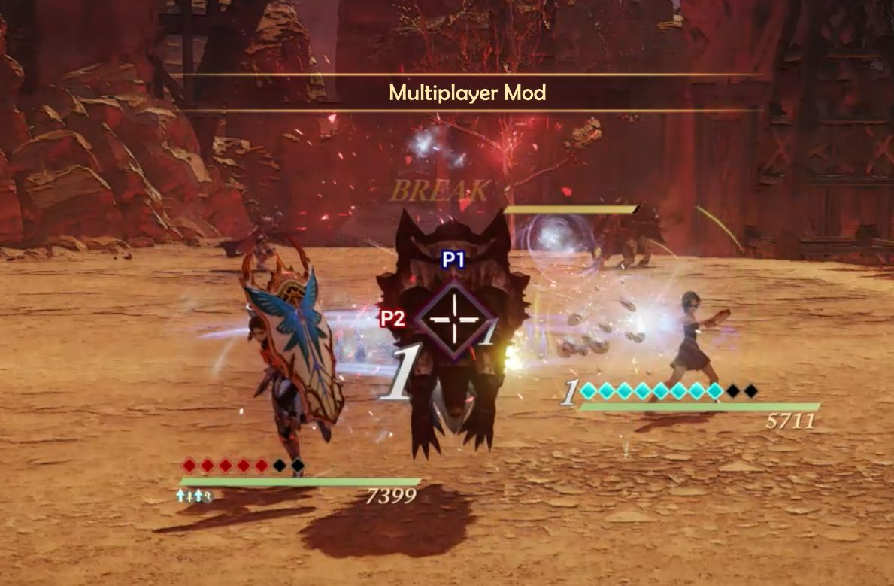

# Tales of Arise: Local Co-Op Mod

Mod that adds multiplayer to Tales of Arise

For progress, see <!-- [Milestones](https://github.com/EusthEnoptEron/arise-multiplayer/milestones) and--> the [Project page](https://github.com/EusthEnoptEron/arise-multiplayer/projects/1).

## Installing

1. Extract files to the game data folder.
2. Start the game.

During battle, controllers will automatically be assigned to the characters. See below for details on the order.

If `xinput1_3.dll` already exists because you installed another mod, skip the file and launch
UnrealEngineModLauncher.exe before starting the game.

## Disabling

1. Remove xinput1_3.dll

## Known Issues

- Changing characters during battle doesn't work
  well. ([#5](https://github.com/EusthEnoptEron/arise-multiplayer/issues/5))
- Causes issues in some of the bonus dungeons / bosses

For a complete list, see [issues](https://github.com/EusthEnoptEron/arise-multiplayer/issues)

Please comment or add new issues if you encounter any that haven't been reported yet.

## Controller Order

- Player numbers are initially assigned in the order Steam reports them.
- When a controller disconnects, the player number is returned to the pool.
- When a controller connects, it is assigned the first free player number.

## Controls

### Overworld Controls

Outside of battle, all controllers are treated equally and can steer the main character and navigate through menus. This
mirrors the default behavior of the game and allows for taking turns without passing around a controller.

### Battle Controls

During battle, each player gets to control their own character. Make sure that P1 (= the flag) is assigned to the top
party member.

The other characters are assigned like so:

| Player | Party Member |
| ------ | ------------ |
| P2     | Left  |
| P3     | Right |
| P4     | Bottom |

## Customizing the Camera

The camera is still very much a work in progress. You can however tweak it to your liking by editing
the `MultiplayerMod.ini` file that comes with the mod. Updates will be applied immediately.
