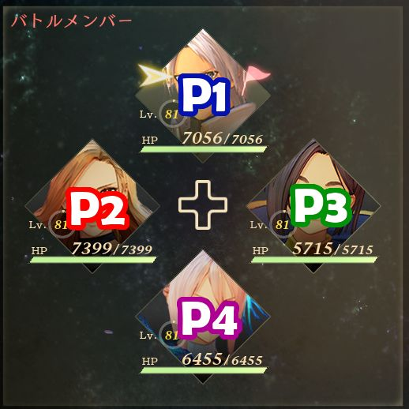

# Tales of Arise: Multiplayer Mod

Mod that adds multiplayer to Tales of Arise. For progress, see <!-- [Milestones](https://github.com/EusthEnoptEron/arise-multiplayer/milestones) and--> the [Project page](https://github.com/EusthEnoptEron/arise-multiplayer/projects/1).

This is still to be considered experimental until someone says it's stable. Let me know via [GitHub](https://github.com/EusthEnoptEron/arise-multiplayer/issues) or [Discord](https://discord.gg/Se2XTnA) when you encounter untracked issues.

## Why?

Because this is how God intended *Tales of* to be.

## How To Install

1. Extract files to the game data folder.
2. Start the game.

During battle, controllers will automatically be assigned to the characters. See below for details on the order.

> :warning: If `xinput1_3.dll` already exists because you installed another mod (e.g. Arise SDK), skip the file and launch UnrealEngineModLauncher.exe before starting the game.

## How To Use

1. Plug in a second (or third, or fourth) controller.

The controllers will then be assigned to the 2nd, 3rd, and 4th character respectively and will be able to control these characters.

For details, [refer to Controls](#controls).

## How To Disable

Temporarily:

- Unplug all other controllers.

Completely:
1. Remove `xinput1_3.dll`.
2. Optionally, remove all files included in the archive.

## Known Issues

No critical issues known at this time.

For a complete list, see [issues](https://github.com/EusthEnoptEron/arise-multiplayer/issues)

Please comment or add new issues if you encounter any that haven't been reported yet.

## Controls

### Controller Order

- Player numbers are initially assigned in the order Steam reports them.
- When a controller disconnects, the player number will become free again and control is returned to the CPU.
- When a controller connects, it is assigned the first free player number.

The characters are assigned in this order:

| Player | Party Member |
| ------ | ------------ |
| P2     | Left  |
| P3     | Right |
| P4     | Bottom |

### Battle Controls

During battle, each player gets to control their own character. Make sure that P1 (= the flag) is assigned to the top
party member.

#### Boost Attacks

At the moment, boost attacks can be used by all players to add some competitiveness to the mix. Let me know if you don't like this behavior and I'll make it configurable.

#### Changing Characters During Battle

While still not completely stable, you *can* change characters during the battle, but you'll have to use the menu to do so.

<kbd>P1</kbd>: Move the flag to the character you want to control and make sure the position is not already taken by another player (or chaos will ensue.)
<kbd>P2</kbd>-<kbd>P4</kbd>: Move the character you'd like to control to your slot. (See [Battle Controls](#battle-controls)) **You can ignore the flag.**

### Overworld Controls

Outside of battle, all controllers are treated equally and can steer the main character and navigate through menus. This
mirrors the default behavior of the game and allows for taking turns without passing around a controller.

Additionally, if you set `AutoChangeCharas` to `1` in the config (see [Customizing the Camera](#customizing-the-camera)),
you will be able to instantly change the visible character with a press of "Reset Camera 2" (default is left bumper) on a controller to its assigned character.

## Customizing the Camera

The camera is still a work in progress. You can however tweak it to your liking by editing
a `MultiplayerMod.ini` file that you place at `...\steamapps\common\Tales of Arise\Arise\Binaries\Win64\MultiplayerMod.ini`. The folder already contains an example file -- simply rename it and delete the `.example` part.

**Hot-reloads when changes are made.**

## Compiling The Code

The project is not currently in a compilable state because of some local changes to the Arise SDK. `// TODO`

## Special Thanks

- RussellJerome, for [Unreal Mod Loader (UML)](https://github.com/RussellJerome/UnrealModLoader)
- emoose, for the [Arise SDK](https://github.com/emoose/Arise-SDK)
- Meebo, for testing and literally playing through the game to provide me with a save file.
